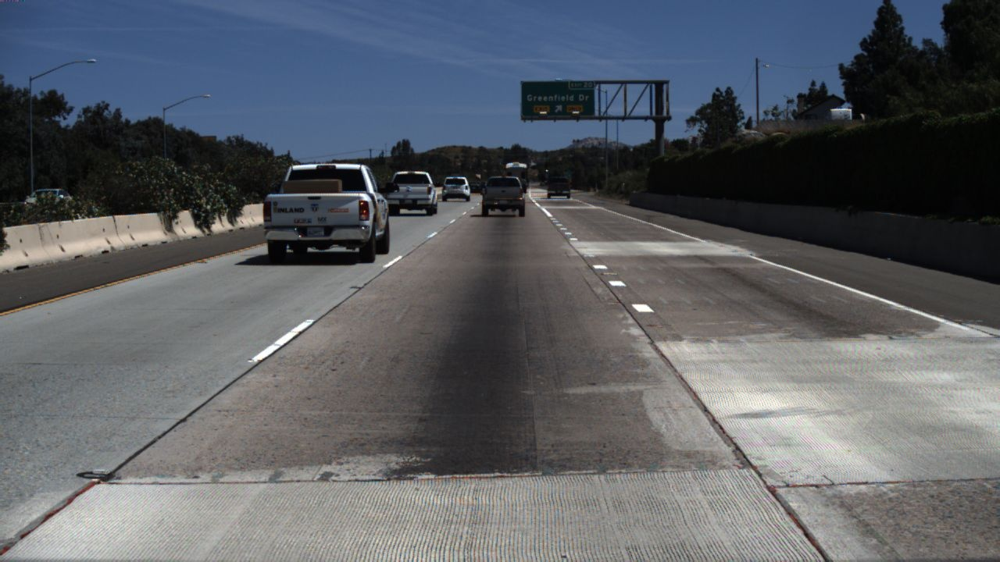

# **基于自实现opencv图像处理函数的静态车道线检测项目**
<!-- TOC -->

- [**基于自实现opencv图像处理函数的静态车道线检测项目**](#基于自实现opencv图像处理函数的静态车道线检测项目)
  - [**1.项目背景**](#1项目背景)
  - [**2.实现**](#2实现)
    - [**2.1 基本思路： 去噪，边缘提取，车道检测**](#21-基本思路-去噪边缘提取车道检测)
    - [**2.2 实现过程**](#22-实现过程)
  - [**3. 结果分析**](#3-结果分析)
  - [**4. 后续**](#4-后续)

<!-- /TOC -->
## **1.项目背景**
**起源于选修邸慧军老师的《数字图像处理》这门课程的最终课程设计项目 ：实现车道线检测**
1. 不能用神经网络（老师的原话是直接喂给神经网络就没有意思了），只能用数字图像处理方法
2. 除了读取与写入之外不能使用其他现成库函数，比如大名鼎鼎的opencv
3. 其实本来计划是MATLAB（教学也是MATLAB），后来我校突然就进美国名单里MATLAB用不了就改c++了

**数据集**   
数据集由720*1280的jpg格式图片组成，实际上就是开车在公路沿途拍下来的，因为我发现数据集的图片之间很有连贯性。其中一张如图所示：
   
**环境**   
我是win10 + vs2019。记得配置opencv，用来读取图片。


## **2.实现**
###  **2.1 基本思路： 去噪，边缘提取，车道检测**    
但在刚刚开始的时候无从下手，因为选择太多了。   
比如说去噪音可以高斯滤波，均值滤波，中值滤波。   
边缘提取你又可以拉普拉斯锐化，sobel算子，Robert算子，scharr算子，candy检测。    
于是我干脆把这些实现一个遍，再慢慢选择好了。    
于是自实现了以下算法：
   1. 彩色图像转灰度
   2. 图像翻转，获得负片
   3. 线性灰度转换
   4. 对数灰度转换
   5. 指数灰度转换
   6. 方框滤波
   7. 均值滤波
   8. 高斯滤波
   9. 中值滤波
   10. 最值滤波
   11. 拉普拉斯锐化
   12. 漫水填充
   13. 阈值分割
   14. 自适应阈值分割
   15. candy边缘检测
   16. scharr边缘检测
   17. sobel边缘检测
   18. Robert边缘检测
   19. 霍夫直线检测
   20. 直方图均衡化    
**所有算法源码均定义位于minicv.h下，最下面有接口参数说明；所有实现位于minicv.cpp下，关键步骤有注释**

### **2.2 实现过程**
0. **以此图片为实例**  


1. **转灰度图**，公式是GRAY = B * 0.114 + G * 0.587 + R * 0.299。目的是为了减少运算量，简化操作。
```c++
 _getGray(img) //有些函数会与opencv重名，所以我自实现的都带下划线。其实也可以自定义namespace
```
效果：
   
   


2. **均值滤波去噪音**。   
   实际上我认为施加平滑滤波的主要原因不是为了去除噪音，因为对于斑点噪音，实际上后面的霍夫变换基本上会忽略。   
   我认为施加滤波之后图像边模糊了（废话）——图片的边缘变宽了，一些细线变粗相当有利于后面的边缘检测。    
   另外，试了高斯滤波与均值滤波，效果相当，就选简单的均值滤波吧  
   施加均值滤波后效果如下
```c++
_blur(img, 3, 3); //大小是 3*3
```
  
   
      


3. **幂指变换**。 本来是没有这一步的，但是到最后发现没有这一步对比较暗的图片实现效果比较差，因为后面有一步数阈值分割。   
   **我把这一步看作这个算法成功的关键之一（另一个是霍夫变换）**。于是增亮有两个选择，直方图均衡化或者幂指变换，事实证明后者效果更加好，   
   使图像整体效果更加符合人眼，也非常有利于阈值选择的普适性
```c++
_gammaGrayReform(img, 2, 1);  
```

   
      
         
            

4. **背景以及两侧扣图**   
   背景以及两侧噪音很多，不如直接把他们给剔除，毕竟数据集车道线主要是前方中间区域
   **代码中我基本上用at方法访问像素，后来知道了指针方法更加快**，不过at比较符合数组访问形式（懒得改.....)
```c++
int h = img.rows;                     //背景处理，减少噪音与运算量
	int w = img.cols;
	for (int i = 0; i < h * 2 / 5; i++) {
		for (int j = 0; j < w; j++) {
			img.at<uchar>(i, j) = 0;  
		}
	}
```
注意两侧处理要在拉普拉斯锐化之后，否则拉普拉斯会把两条直线看作边缘了
```c++
img = _lpFilter(img, 1);              //拉普拉斯锐化
img = _myFilter(img, ker);            //检测y方向边缘

	for (int i = 0; i < h; i++) {         //两侧处理，减少噪音与运算量
		for (int j = 0; j < w; j++) {
			if ((double)i <= -0.8 * j + (double)600 || (double)i <= 0.8 * j - (double)440) {
				img.at<uchar>(i, j) = 0;
			}
		}
	}
```   
   
      

5. **拉普拉斯锐化**本质是为了提取边缘，经过实践发现scharr算子增加了很多不必要的细节，Robert算子和sobel算子也实现效果均不如拉普拉斯，   
   candy算法一个是效果比较慢，另一个是延迟阈值化的两端参数不能很好的普适（有些图合适，另一些不一定合适）。
```c++
_lpFilter(img, 1);//1是选择核的参数，感兴趣可以阅读代码
```
为了感受边缘提取的效果特地去除了背景扣图这一部分
  
   
      


6. **检测y方向边缘**。考虑到车道线基本分布在y方向，偏差不会太大。自定义了一个检测y方向的算子
```c++
const vector<vector<double>> ker = {		//用于检测y方向边缘的算子
	{-1,0,1},
	{-2,0,2},
	{-1,0,1}
};
 _myFilter(img, ker); 
```
为了感受边缘提取的效果特地去除了背景扣图这一部分


7. **阈值分割** 一来为了减少运算量，二来也是减少了不必要的干扰
```c++
 _thredShold(img, 120);  
```


8. **霍夫检测**。可以说是本算法的灵魂了，发现（发明？）这种方法的简直是天才，抗干扰性非常非常强大！
```c++
_houghDetectline(img);
```
其他实现就不贴代码了，这个霍夫变换实现代码值得贴出来。（这是我的粗糙版本，opencv自带的算法肯定处理得好很多很多）   
可以大大优化在于： vote可以用unordered_map实现，它的增删查改操作都是O（1），但是需要自定义哈希函数等等额外操作。
```c++
cv::Mat _houghDetectline(const cv::Mat& src) {

	Mat img = src.clone();

	extern const double PI;
	const int h = img.rows;
	const int w = img.cols;
	const int n = h * w + 1000;

	map<vector<int>, int> vote;    //统计票数 vector0-r , vector1-theta
	
	int max = 0;
	for (int y = 0; y < h; y++) {     //霍夫空间计算票数
		for (int x = 0; x < w; x++) {
			if (img.at<uchar>(y, x) <= 20) { //减少计算量
				continue;
			}
			for (int theta = 20; theta <= 180; theta++) {
				if (abs(theta - 90) <= 10 ) {   //一般车道线都是前方，而不是垂直与前方
					continue;
				}
				int r = x * cos(theta * PI / 180) + y * sin(theta * PI / 180);
				vote[{r,theta}] ++;
				
				if (max <= vote[{r, theta}]) {
					max = vote[{r, theta}];
					//cout<<"vote = "<< max << " r = " << r << " theta = " << theta << endl;
				}
			}
		}
	}

	vector<vector<bool>> mask(h, vector<bool>(w));
	for (int y = 0; y < h; y++) {
		for (int x = 0; x < w; x++) {
			mask[y][x] = 0;
		}
	}

	int line = 2; //两条车道线
	while (line--) {

		auto it = max_element(vote.begin(), vote.end(), cmp_value);
		int r = it->first[0]; //cout << r << "  ";
		int theta = it->first[1]; //cout << theta << endl;
		for (int y = 0; y < h; y++) {
			for (int x = 0; x < w; x++) {
				int tar = x * cos(theta * PI / 180) + y * sin(theta * PI / 180);
				if (tar == r) {
					mask[y][x] = 1;
				}
			}
		}

		int limit = 500;
		while (limit-- && !vote.empty()) {  //直线聚类

			auto p = max_element(vote.begin(), vote.end(), cmp_value);
			int pr = p->first[0];
			int pth = p->first[1];
			if (abs(r - pr) <= 60 || abs(theta - pth)<=5) {
				vote[{ pr,pth }] = 0;
			}
			else {
				break;
			}
		}
	}
	for (int y = 0; y < h; y++) {
		for (int x = 0; x < w; x++) {
			if (mask[y][x]) {
				img.at<uchar>(y, x) = 255;
			}
			else {
				img.at<uchar>(y, x) = 0;
			}
		}
	}
	

	//cv::imshow("hough", img);
	//cv::waitKey(0);
	return img;
}
```


9. **效果**


## **3. 结果分析**
1. 基本上表现不错，部分结果如下


2. 但是也有部分将道路边缘识别成车道线，这种事情发生的概率我看了一下大概每17张图片就出现2张。也展示一下.   
   出现的原因有1）出现大型车辆，使车道线不明显于道路两侧 ； 2）部分路段道路施工，扩宽的区域颜色对比强烈


3.  由（2）准确率可以近似认为15/17 = 88.24%
   

## **4. 后续**
1. 可能会加入多线程处理数据
2. 可能想自己实现一下用神经网络处理的效果   
      
         
            
               
                  
                     
                        
                           
                              
                                 
                                    
                                       
                                          
                                             
                                             
